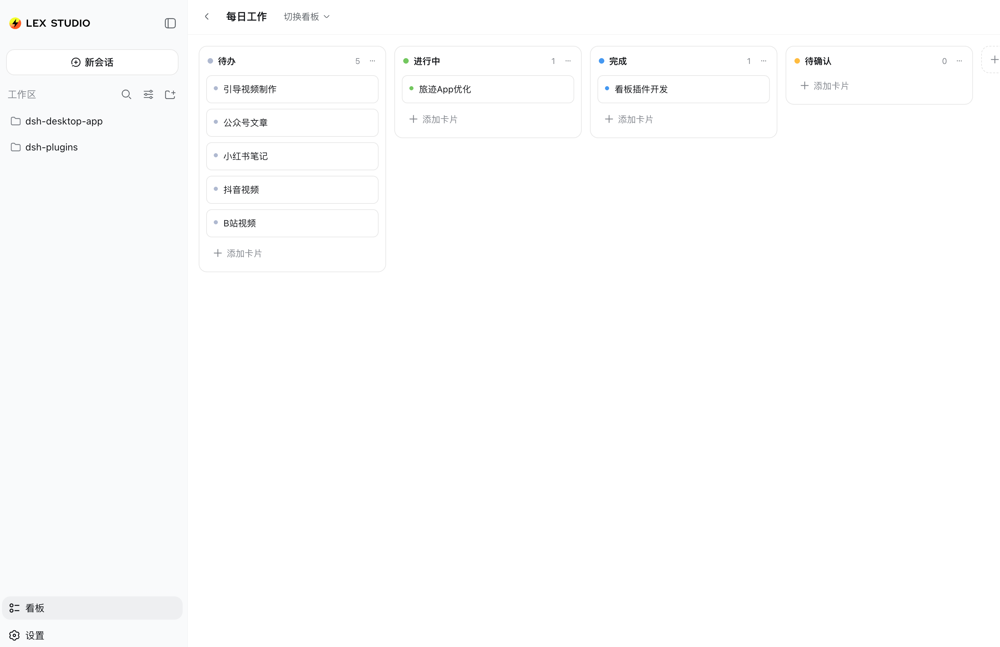

# dsh-tryboard-plugin

DeepSeek Harness（DSH）Web GUI 内置的 **Trello 风格工作看板（看板）**。

在侧边栏「设置」上方新增一个 **看板** 入口；点开后，看板页直接铺在当前会话的主内容区
（侧边栏保持可见可用）——相当于在 DSH 里直接规划“今天要做什么”，不用切换应用。
数据持久化在 DSH 的设置中（`settings.yaml` 的 `tryboard` 命名空间），重启不丢。

## 预览



> 侧边栏「看板」入口（设置上方）→ 当前会话主内容区展开的工作看板：
> 默认四列（待办 / 进行中 / 完成 / 待确认），卡片跨列拖拽即自动切换状态。

## 功能

- **多个工作看板**：可创建任意多个看板，每个看板可自定义名称（点击标题重命名）；
  头部提供看板切换器，支持切换 / 新建 / 删除看板。
- **默认四列**：每个看板自带 `待办` `进行中` `完成` `待确认` 四列（跟随界面语言，
  英文环境为 To Do / In Progress / Done / Pending），列头带状态色点。
- **卡片状态随列自动切换**：卡片拖到哪一列，状态就是哪一列；卡片上的小色点实时反映状态。
- **Trello 式拖拽**：卡片可跨列拖拽、同列内排序，拖拽时显示插入指示线。
- **自定义列**：最后一列后面有「添加列」，可自由增删自定义列（状态为自定义/灰色）。
- **卡片与列管理**：点击卡片/列标题即可重命名；列菜单可重命名/删除（删除带确认）；
  列尾「添加卡片」快速建卡。
- **原生风格**：全部使用 DSH 设计令牌（`--dsw-*` / `--ds-*`）绘制，自动跟随浅色/深色主题，
  不引入任何外部样式。
- **快捷操作**：`Esc` 关闭看板页 / 取消编辑；侧边栏收起时入口变为纯图标。

## 安装

### 方式一：一键脚本（本地目录，软链安装，改动即时生效）

```bash
./scripts/install.sh                # 安装到 web profile
./scripts/install.sh --profile xxx  # 指定 profile
```

### 方式二：dsh CLI

```bash
dsh plugin --profile web add -w /path/to/dsh-tryboard-plugin
```

### 方式三：从 GitHub 安装

```bash
dsh plugin --profile web add git+https://github.com/<你的用户名>/dsh-tryboard-plugin.git
```

安装后 **重启 DSH 一次**（服务端半与 api-proxy 白名单补丁在下次启动生效），
然后点侧边栏「看板」即可。

> 客户端代码（看板页）支持热更新：宿主运行期间修改 `lib/client.js` 会自动生效；
> `lib/index.js`（服务端半）需要重启 DSH。

## 数据与存储

- 全部看板数据是一份 JSON 文档，存放在 DSH 设置的 `tryboard` 命名空间
  （`~/.dsh/settings.yaml` 的 `tryboard.data` 字段，JSON 字符串）。
- 结构：

  ```json
  {
    "v": 1,
    "activeBoardId": "…",
    "boards": [
      {
        "id": "…",
        "name": "每日工作",
        "createdAt": 1712345678901,
        "columns": [
          {
            "id": "…",
            "title": "待办",
            "status": "todo",
            "builtin": true,
            "cards": [{ "id": "…", "title": "写周报", "createdAt": 1712345678901 }]
          }
        ]
      }
    ]
  }
  ```

- `status` 取值：`todo` `doing` `done` `review`（四个默认状态列）或 `custom`（自定义列）。
- 数据随 DSH profile 存储；如需迁移/备份，直接备份 `~/.dsh/settings.yaml` 即可。

## 工作原理（给开发者）

插件是标准的 DSH Cordis 插件，一宿主（server）一半浏览器（client）：

| 文件 | 角色 |
| --- | --- |
| `lib/index.js` | 宿主半：注册 `tryboard` 设置命名空间（schemastery schema），并幂等地把 `tryboard` 加入宿主 api-proxy 的 Web 设置白名单（下次启动生效） |
| `lib/client.js` | 浏览器半：注入侧边栏入口与看板页，持有全部交互逻辑与状态 |
| `cordis.patch.yml` | 把插件 id 插入宿主的 Cordis bundle 层 |
| `package.json` | `dsh.bundle.patch` 指向补丁文件；`dsh.client` 声明 Web 客户端 bundle 及其依赖模块 |

浏览器半用到的宿主插槽（slots）：

- `sidebar.footer.action`（list，root 作用域）：设置行上方的侧边栏脚部动作位——看板入口；
- `shell.overlay`（list，root 作用域）：应用框架级浮层位——看板页渲染于此，
  但通过测量侧边栏列宽（`[data-shell-overlay]` 的父级首个子元素 + `ResizeObserver`）
  让页面只铺在**主内容区**（`left: 侧边栏宽`），侧边栏保持可见可用。

状态与持久化：客户端用一个模块级 store（`useSyncExternalStore`）持有
`{ open, persistence, data }`；所有变更即时更新 store，并防抖 400ms 通过
`ctx.settingsScope.bind({ namespace: "tryboard" }).set("data", JSON)` 写回宿主设置。
宿主文档变更（其他客户端写入、外部修改）通过设置失效订阅自动回读合并。

## 卸载

```bash
dsh plugin --profile web remove dsh-tryboard-plugin
```

再重启 DSH。看板数据仍留在 `settings.yaml` 的 `tryboard` 字段中，可手动删除。

## 兼容性

- DSH Desktop / dsh web（Cordis 插槽系统版本，`rc.6` 系）；
- Node ≥ 20（宿主侧）。

## License

MIT
